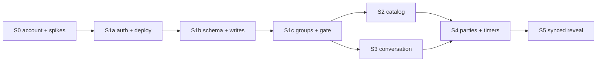

# Spoilies Implementation Staging

**Goal:** Decide how the design in
[`docs/superpowers/specs/2026-08-02-async-tv-discussion-design.md`](../specs/2026-08-02-async-tv-discussion-design.md)
gets built — the stages, their order, what each one must prove before the next starts, and
where this staging deliberately departs from the spec's §10 phasing.

**Spec:** `docs/superpowers/specs/2026-08-02-async-tv-discussion-design.md`

**Status:** Roadmap. No stage is planned at task level yet.

## What this document is, and is not

This is the *staging* layer. It sits between the spec and the per-stage implementation plans:

- The **spec** decides what the product is and why.
- **This document** decides what ships in what order, what each stage must prove, and where
  the phase boundaries actually fall.
- A **per-stage plan** (`docs/superpowers/plans/YYYY-MM-DD-<stage>.md`) decides the individual
  tasks, tests, and commits. Written one stage at a time, immediately before that stage is
  built — not all up front, because each stage's spikes and surprises should inform the next
  plan rather than invalidate a plan written months earlier.

Nothing here overrides the spec. Where this document resolves something the spec left
ambiguous, it says so explicitly under [Phase boundaries the spec leaves ambiguous](#phase-boundaries-the-spec-leaves-ambiguous).

## What decides the order

Five principles, in priority order. Every deviation from §10 below traces to one of them.

1. **Wall-clock dependencies first.** The AWS account must exist four days before it could
   ever be removed from the organization (§9). It costs nothing to create early and cannot be
   accelerated later. It is therefore the first action taken, ahead of any decision about code.
2. **Unverified assumptions before the code that rests on them.** §11 lists two open
   verifications. Both can invalidate an architecture decision, both are answerable with
   throwaway code in under a day, and both get answered before anything depends on them.
3. **A deployable walking skeleton before any feature.** An end-to-end request path — CloudFront
   → OAC → Function URL → axum → DSQL — proven with a trivial handler, so that every subsequent
   stage debugs *its own* logic rather than the pipeline underneath it.
4. **Cross-cutting write-path machinery lands with the first write, not with the phase that
   stresses it.** Retrofitting an OCC retry wrapper into fifteen existing handlers is strictly
   worse than writing the first handler through it.
5. **The spoiler gate is the payoff, and it is reached as early as the above allows.** It is
   the one thing the product rests on (§7), so it is built while attention is fresh and it
   becomes the reference the later stages imitate.

## The stages

| Stage | Name | Maps to | Ships |
| --- | --- | --- | --- |
| **S0** | Account, Terraform, and the two spikes | §10 P0 (+ P1's OAC verification) | Nothing user-facing. A deployable empty Lambda and two answered questions. |
| **S1a** | Walking skeleton: auth and deploy | §10 P1 (split) | `GET /api/me` behind a real Cognito JWT, deployed by CI. |
| **S1b** | Schema, migration runner, write path | §10 P1 (split) | Migrations running from CI against DSQL. First writes, with OCC retry. |
| **S1c** | Groups, invites, posts, and the gate | §10 P1 (split) | The product's core loop, on a hand-seeded catalog. |
| **S2** | Catalog | §10 P2 | TMDB search, ingest, scheduled sync. |
| **S3** | Conversation depth | §10 P3 | Replies, reactions, edits, deletes, note counts. |
| **S4** | Watch parties and timers | §10 P4 | Households, sharing fan-out, the watch timer. |
| **S5** | Synced reveal | §10 P5 | `synced` mode and the polling read path. |



S2 and S3 are independent of each other and could be reordered or interleaved; everything
else is a hard chain.

---

### S0 — Account, Terraform, and the two spikes

**Goal:** Everything that must be true before application code can deploy, plus answers to
both open verifications in §11.

**Why here:** Principles 1 and 2. The account has a four-day clock on it, and both spikes can
change an architecture decision — `sqlx` offline mode would change the build; the OAC
`Authorization` collision would change the auth path in every handler.

**Contents:**

- The AWS account itself, in the organization, us-east-2, with a dedicated root email alias
  that can be handed to a company later (§9). Not a delegated administrator for anything.
- Scripted Terraform state bucket — versioning, public-access block, KMS — matching the
  `AmazonWebServices` conventions. Hand-run; it cannot be a resource in the configuration it
  stores (§9).
- Terraform, applied from a laptop under SSO, creating: the code bucket, the GitHub OIDC
  provider, and the two roles `spoilies.github-deploy` and `spoilies.github-migrate` with the
  trust scoping in §9. All `resource`s here, never `data` sources.
- The Lambda function itself with a **reserved concurrency cap of ~10** and an **AWS Budgets
  alarm** — §6 names the concurrency cap the highest-value control in the design, and it costs
  nothing to set on an empty function.
- CloudFront distribution, OAC, and the viewer-request function forwarding `Authorization` to
  `X-Forwarded-Authorization`. **No S3 origin behaviour yet** — no client exists, so `/api/*`
  is the only behaviour and the second origin is added when a client is.
- CI: Terraform `init -backend=false`, `fmt -check`, `validate`, with no AWS credentials
  configured at all (§9).

**Spike A — `sqlx` offline mode on musl/ARM (§11).** Compile-time query checking needs a live
Postgres at build time or a committed `.sqlx` cache, and CI cross-compiles to
`aarch64-unknown-linux-musl` with no database. Verify in the same spike that the AWS DSQL SQLx
connector's TLS stack builds and links on that target. *If it fails:* the fallback is
`sqlx::query` without the macros, which forfeits the compile-time checking §3 lists as a
deciding advantage of Rust — that is a design-level answer and it belongs before S1b, not
during it.

**Spike B — CloudFront OAC to a Lambda Function URL (§3, §11).** Confirm the `Authorization`
forwarding function works, and specifically **how request bodies are signed for POST/PUT**.
*If it fails:* the auth transport changes for every route, so it must be answered before S1a
writes middleware against it. The spec assigns this to P1; it moves here because S0 already
stands up the distribution and the empty Lambda, making the verification nearly free at this
point and expensive later.

Both spikes are throwaway. Whatever they prove gets written down; whatever code they produce
gets deleted or reduced to the one working configuration.

**Exit criteria:**

- `terraform apply` from a laptop produces the full estate; `terraform plan` is clean on rerun.
- A push to `main` deploys a zip and the function serves a 200 through the CloudFront hostname.
- A direct call to the `*.lambda-url.us-east-2.on.aws` hostname returns 403.
- Both spikes have written answers in this repo, and the OAC answer names the exact header the
  middleware will read for POST/PUT bodies.

**Explicitly not in S0:** DSQL cluster wiring in application code, Cognito, any schema, any
route beyond a health check.

---

### S1a — Walking skeleton: auth and deploy

**Goal:** A real authenticated request reaching a real handler, deployed by CI.

**Why here:** Principle 3. Every later stage inherits this path, and a bug in it is
misdiagnosed as a bug in whatever feature is being written at the time.

**Contents:**

- Cognito user pool, Lite tier, **phase-A posture**: `AllowAdminCreateUserOnly`, email only,
  no triggers, no federated IdPs (§6). One hand-provisioned user.
- axum behind `lambda_http`, module skeleton (see [Module layout](#module-layout)), health
  route.
- Auth middleware: JWKS fetched and cached, refetched on unknown `kid`, RS256 pinned, audience
  checked, 503 on JWKS failure and **never** a fall-through to anonymous (§7). Reads
  `X-Forwarded-Authorization` when behind CloudFront, per Spike B.
- `GET /api/me` returning the token's identity only — no database yet.
- Error type and the status conventions table from §7 wired once, centrally, including **404
  for both unauthorized and nonexistent**.
- Integration test harness: testcontainers Postgres stood up but unused, so S1b adds queries
  rather than infrastructure.

**Exit criteria:** A `curl` with a Cognito access token against the CloudFront hostname returns
the caller's identity; the same call without a token returns 401; a tampered token returns 401;
a JWKS outage returns 503 rather than 200.

---

### S1b — Schema, migration runner, and the write path

**Goal:** Migrations running from CI against DSQL, and the first rows written safely.

**Why here:** Principle 4. This stage builds the machinery every subsequent write depends on,
and it is the last point at which that machinery is cheap to get right.

**Contents:**

- **Migration runner** (§7): hand-rolled against a `_migrations` table, one statement per file,
  autocommit with no wrapping transaction, `CREATE INDEX ASYNC` → `CREATE INDEX` when targeting
  Postgres as the single sanctioned rewrite, `sys.wait_for_job(job_id)` awaited before a
  migration is marked applied, and a **loud failure** on an `INVALID` index requiring a manual
  `DROP INDEX`.
- **Migration lint** in CI, rejecting foreign keys, triggers, PL/pgSQL, temp tables,
  multi-statement files, and any rewrite other than the sanctioned one (§7).
- **Schema for the tables S1c needs**: `account`, `group`, `membership`, `invite`, `title`,
  `episode`, `group_title`, `post`, `reveal`, `watched_episode` — every uniqueness constraint
  declared **inline on `CREATE TABLE`** so nothing enters the async index path (§4). The one
  async index is `(title_id, season_number, episode_number)`, which is deliberately non-unique.
- **`db::retry`** — the bounded OCC retry wrapper: three attempts with backoff on SQLSTATE
  `40001`, then 409 (§7). Every write in the codebase goes through it from the first one.
- **Lazy `account` creation** in the auth middleware: a valid JWT with an unknown `cognito_sub`
  inserts a row from the token's `sub` and `email`, lowercased (§6).
- CI migration job assuming `spoilies.github-migrate`, running **before** the code deploy, with
  expand/contract as a standing rule from the first migration onward (§7).

**Exit criteria:** CI applies migrations to a dev DSQL cluster and then deploys; `GET /api/me`
returns a persisted account row created on first sight of the token; a deliberately conflicting
pair of writes exercises the retry wrapper in a test and surfaces a 409 only after three
attempts; the lint rejects a foreign key in a test fixture.

---

### S1c — Groups, invites, posts, and the spoiler gate

**Goal:** The product's core loop, working end to end on a hand-seeded catalog.

**Why here:** Principle 5. Everything before this exists to make this stage possible.

**Contents:**

- Group lifecycle: create (creator seeded `admin`), read, delete; membership with `role`,
  nullable `display_name` resolving by `COALESCE`, palette-name `accent_color` assigned
  first-unused-in-group.
- The two unadministrability invariants from §4, app-layer: a group always has at least one
  admin (demotion is self-only), and the last admin cannot leave while other members remain —
  409 in both cases.
- Removal versus leaving: `left_at` alone, versus `left_at` **and** `removed_by`, with
  `POST /api/invites/:token/accept` refusing while `removed_by` is set, and re-admission as an
  explicit admin action.
- Invites: ≥128-bit random tokens, constant-time comparison, never sequential, redemption
  rate-limited per forwarded client IP (§6.3). The **per-instance GCRA limiter** lands here and
  S2 reuses it — noise suppression, explicitly not the control that makes invites safe.
- Posts: portable (`group_id IS NULL`) and scoped, created through
  `POST /api/groups/:g/episodes/:e/posts` with `scope`. Server-assigned `created_at`, never
  accepted from the client — §5 makes it a security boundary, not an audit column.
- `reveal` in `open` mode only (with `hidden` deleting the row) and `watched_episode`, both as
  idempotent `PUT`s, plus `POST /api/titles/:t/watched-through` with the season-0 and unaired
  exclusions and fixed-size chunking under the 3,000-row cap.
- **The board read**: `members_at` evaluated at each post's `created_at`, keyset cursor on
  `(created_at, id)`, flat chronological order, and the locked-board response — your own posts
  always, plus the distinct *other* authors filtered through `members_at` and excluding you.
- **The season grid** `GET /api/groups/:g/titles/:t`, carrying the same author floor.
- The **hand-seeded catalog** as a seed migration with real TMDB IDs and real episode structure
  (§10 P1), ordered by `(season_number, episode_number)` with season 0 first — the convention
  S2's ingest must preserve rather than reinvent.
- The type wall: a response type constructible only from reveal-filtered rows (§3). Established
  here so every later stage inherits it rather than opting into it.

**Exit criteria:** Two hand-provisioned accounts, one group, one seeded show. Account A writes
a note on episode 4; account B, who has not revealed episode 4, sees a locked board naming A
and no bodies; B reveals and sees the note; B's own earlier note on episode 4 was visible to B
throughout. The §7 invariant test — *a post the caller may not see never appears in any
response shape* — passes, with its own cases for both locked-board exceptions.

---

### S2 — Catalog

**Goal:** Shows are added by search rather than by migration.

**Contents:** TMDB search proxy with the per-account rate limit reusing S1c's limiter; skeleton
ingest on `POST /api/groups/:g/titles`; `group_title` management; the scheduled Lambda
entrypoint via EventBridge Scheduler, running the ~90-day TMDB refresh **in place, matching on
`episode.tmdb_id`**, never delete-and-recreate (§2). The same scheduled job gains invite and
`watch_session` pruning and the ~90-day dormant-group sweep as those tables arrive.

TMDB attribution — logo and the required notice — ships with this stage, since this is where
TMDB data starts arriving.

**Exit criteria:** A show is added by search, its episodes match the shape S1c's seed produced,
a forced re-sync updates a renamed episode in place while its posts stay attached, and a
partial TMDB failure leaves no half-ingested season.

---

### S3 — Conversation depth

**Goal:** The board becomes a conversation rather than a list.

**Contents:** Replies (always `group_id` set, parent must be visible in that group), reactions
keyed `(post_id, group_id, account_id, emoji)` as an explicit `{emoji, on}` `PUT`, edits
stamping `edited_at` while freezing `created_at`/`offset_secs`/`reply_to_post_id`, hard delete
detaching replies via `reply_to_post_id → NULL` and `parent_deleted_at → now`, exact note counts
behind `account.show_note_counts`, and `account.show_unrevealed_episode_titles`.

Schema note: `reply_to_post_id` and `parent_deleted_at` are added here as nullable columns under
expand/contract, not created in S1b. Additive DDL is cheap and the columns have no meaning until
this stage.

**Exit criteria:** A reply renders as a quote; deleting the parent leaves the reply standing and
marked; a visible reply whose parent is *hidden* renders without its quote; counts exclude the
caller's own notes.

---

### S4 — Watch parties and timers

**Goal:** Households tick an episode once, and posts land on a timeline.

**Contents:** `watch_party` and `watch_party_member` with the email-addressed invite always
answering 202, the pending/active consent flow, the ten-active-member cap, write-time fan-out
gated on `sharing_enabled` at both ends, and hard-delete on leaving. `watch_session`,
`watch_offset`, and `post.offset_secs` — with the four-hour running cap applied on the read path
in the shared session helper, and lazy cleanup when an account's sessions are touched.

This is the first stage with real concurrency exposure. S1b already built the retry wrapper, so
this stage *stresses* it rather than introducing it — which is the whole reason for moving it
earlier.

**Exit criteria:** A three-member party ticks one episode once; a member with `sharing_enabled`
off neither broadcasts nor receives while the others stay in sync; a session left running for a
day stamps a post at the cap rather than at wall-clock; a 250-episode bulk write for a
ten-member party commits in chunks and never exceeds 3,000 rows in a transaction.

---

### S5 — Synced reveal

**Goal:** Posts appear in step with the timer.

**Contents:** `synced` as a new `reveal.mode` value, the polling read path computing the
caller's position server-side from `watch_session` and `watch_offset` — never from a request
parameter — the two-sided comparison shifting each post by *its author's* correction, ETag/304
on responses, the ~5 second lookahead, and the server clock in the response body.

The two questions §4 defers until this stage — what happens to posts with `offset_secs = NULL`,
and the API shape implication of a continuously changing visible set — are answered in this
stage's plan, not before.

**Exit criteria:** A client polling at 15s intervals sees posts appear on time; a client lying
about anything cannot advance the gate, because there is no position parameter to lie with;
unchanged polls return 304.

---

## Deviations from the spec's §10 phasing

Each of these is a staging decision, not a design change. The spec's phases are unchanged in
content; what moves is *when* a piece of work happens.

1. **The OAC verification moves from P1 to S0.** §11 assigns it to P1 because it needs a
   deployed distribution. S0 deploys one anyway, so the verification is nearly free there and
   expensive once middleware and handlers are written against an assumed answer.
2. **P1 splits into three stages.** As written, P1 bundles Cognito, DSQL wiring, the migration
   runner, CloudFront and OAC, the deploy pipeline, five tables, seven route families, and the
   spoiler gate. That is too large to plan, review, or debug as a unit, and it has no
   intermediate point where something works. S1a/S1b/S1c each end at a running, testable
   deliverable.
3. **The OCC retry wrapper moves from P4 to S1b.** §10 lands "the OCC retry work" in P4 because
   P4 is where concurrency exposure becomes real. But the wrapper is a cross-cutting write-path
   helper, and every write from S1b onward should be written through it. Retrofitting it into
   existing handlers later means auditing every write in the codebase for retry safety — the
   exact audit that writing them through it from the start makes unnecessary.
4. **The season grid is named explicitly in S1c.** §10's P1 description lists the board read
   but not `GET /api/groups/:g/titles/:t`. The board is unreachable without it, so it ships in
   S1c; only its *note counts* wait for S3.
5. **The rate limiter arrives in S1c rather than S2.** §6.3 requires rate-limited invite
   redemption, which ships with invites. S2's TMDB cap then reuses it.
6. **CloudFront's S3 origin is deferred out of S0** to whenever a client is built. §10's P0 does
   not require it, and a second origin behaviour with no origin behind it is configuration
   waiting to rot.

## Phase boundaries the spec leaves ambiguous

Resolved here so the per-stage plans do not each re-litigate them.

- **The locked-board author list is S1c; exact note counts are S3.** §10 puts "note counts and
  the display preferences that govern them" in P3, but §5 makes the author list the *floor* —
  always visible, not configurable, and part of what a locked board returns. The floor is
  therefore part of the gate and ships with it. S3 adds only the exact counts and the
  preference toggling them.
- **`show_unrevealed_episode_titles` is S3, and S1c behaves as though it is on.** It defaults to
  shown (§2), so S1c showing titles unconditionally is the correct default behaviour rather than
  a shortcut, and S3 adds the ability to turn it off.
- **Tables are created in the stage that first needs them; columns are added the same way.**
  §4's schema block is the finished shape, not a first migration. S1b creates ten tables;
  `watch_party`, `watch_party_member`, `watch_session`, and `watch_offset` arrive in S4, and
  `post`'s `reply_to_post_id`, `parent_deleted_at`, and `offset_secs` arrive in S3 and S4 as
  nullable additive columns. Expand/contract is already a standing rule (§7), so additive DDL is
  routine — and creating a column three stages before anything reads it is a column nobody
  validates.
- **`role` is the exception to that rule** and ships in S1c, per §10's explicit reasoning: it is
  a column on a table S1c already creates, and adding it later needs a backfill deciding who was
  retroactively in charge of every existing group.

## Module layout

Proposed for S1a, so that each later stage adds files rather than restructuring. Split by
responsibility; the pure-logic layer is deliberately separable from everything that touches a
database, because §7 names that tier the highest-value tests in the design.

```
src/
  main.rs          lambda_http entrypoint; dispatches HTTP vs scheduled events
  app.rs           axum Router assembly and layer order
  config.rs        environment configuration
  error.rs         one error type; the §7 status table lives here, including 404-for-both
  auth/
    mod.rs         middleware: bearer extraction, lazy account creation, membership resolution
    jwks.rs        cached JWKS, RS256 verification, audience and issuer checks
  db/
    mod.rs         pool and DSQL connector wiring
    retry.rs       bounded OCC retry on SQLSTATE 40001
    migrate.rs     the migration runner
  domain/          pure functions, no database: members_at, reveal filtering, session offset
                   with the 4h cap, watched-through range, bulk chunking, accent palette
  repo/            sqlx queries, one module per aggregate
  view/            response types constructible only from reveal-filtered rows — the type wall
  api/             handlers, one module per resource, returning `view` types
  tmdb/            client and ingest                                    (S2)
  scheduled/       the sweep entrypoint                                 (S2)
migrations/
tests/
```

## What to plan next

**S0**, at task level, as `docs/superpowers/plans/<date>-s0-account-and-spikes.md`. It is the
only stage with no prerequisites, and both its spikes feed decisions that the S1a plan needs
before it can be written honestly.
